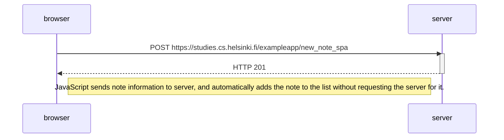

```mermaid
sequenceDiagram
    participant browser
    participant server

    browser->>server: POST https://studies.cs.helsinki.fi/exampleapp/new_note_spa
    activate server
    server-->>browser: HTTP 201
    deactivate server
    
    Note right of browser: JavaScript sends note information to server, and automatically adds the note to the list without requesting the server for it.
```